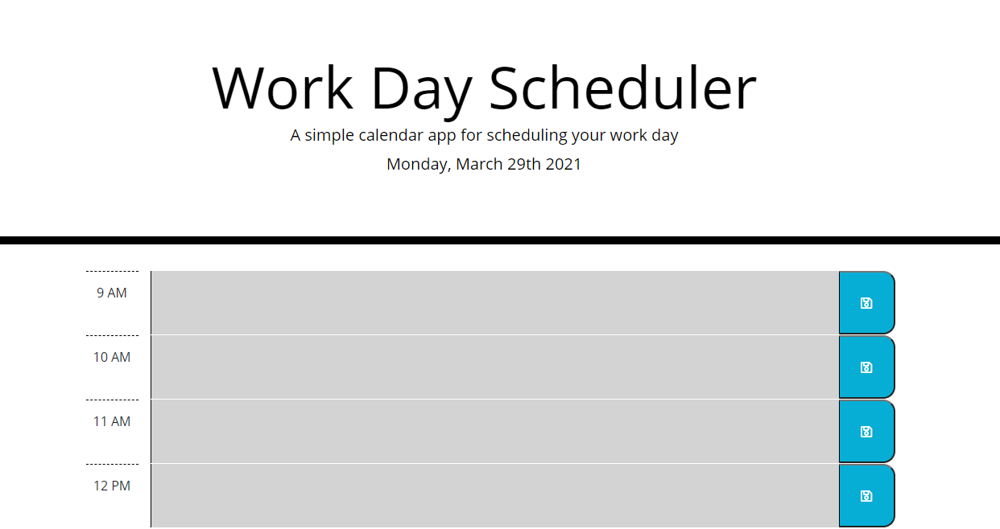

# Work-Day-Scheduler

## Goals of the project :

`To build a daily planner, so that an Employee can add his/her daily events and manage the time effectively.`

## Table of Contents

- [Features](#features)
- [Link of the website](#link-of-the-website)
- [Screenshot of the website](#screenshot-of-the-website)
- [Technologies Used](#technologies-used)
- [Got Any Questions](#got-any-questions)
- [License](#license)

## Features

This application has the following features:

- The application displays the current day at the top of the calendar.
- The application also displays timeblocks for standard business hours.
- The timeblock is color coded to indicate whether it is in the past, present, or future.
- User can enter a event by clicking into a timeblock.
- User can save the text for that event by clicking on the save button for that timeblock.
- The application persists the saved events after refreshing the page.

## Link of the website

https://tinkubansal95.github.io/work-day-scheduler/

## Screenshot of the website

## Technologies Used

- JavaScript
- JQuery
- HTML
- CSS
- Bootstrap
- Moment.js API

## Got Any Questions

Feel free to reach me through
tinkubansal21@gmail.com

## License

Licensed under the [MIT](https://github.com/tinkubansal95/work-day-scheduler/blob/main/LICENSE) license.

---

© 2021
